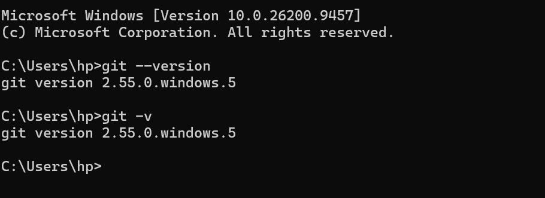
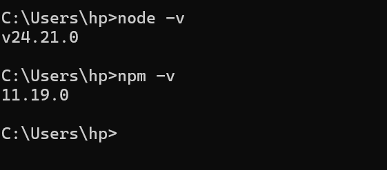
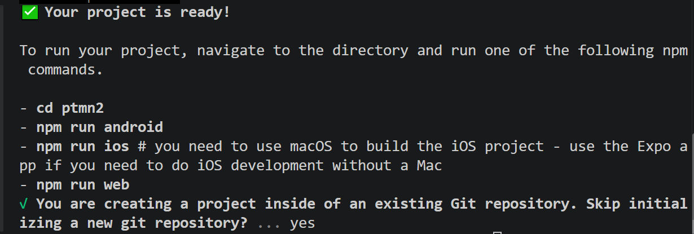
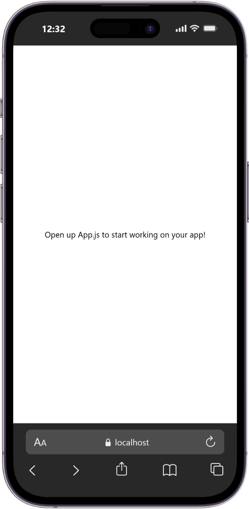

# Praktikum menyiapkan lingkungan pemngembangan dan memulai pemrograman mobile (react native) #

# Tujuan pembelajaran ##
mahasiswa mampu :
1. Menyiapkan lingkungan pengembangan dan memulai pemrograman mobile (native react)
2. membuat aplikasi mobile dengan react native
3. menyelesaikan tugas CV sederhama dengan react native

## Materi dan laporan praktikum ##
1. Menyiapkan lingkungan pengembangan dan memulai pemrograman mobile (native react)
 - Memastikan Instalasi Git bash
 - cek instalasi Git bash (git--version)
 - bukti verivikasi

 

 - Memastikan node.JS dan NPM
  - Download dan install Node.JS di https://nodejs.org/en/download/
  - konfirmasi Node.JS dan NPM (node -v, npm -v)

  

2. membuat aplikasi / projek baru dengan react native
 - buka dan baca dokumentasi resmi link https://docs.expo.dev/
 - buka dan baca dokumentasi resmi link https://reactnative.dev/docs/
 getting-starter
 - Memulai membuat projek baru
 - open termina change directory ke pertemuan-2
 - masukan perintah (npx create-expo-app ptmn2 --template blank)
 - bukti verifikasi

 
 - Running projek
  - Cd ke ptmn2
  - npx expo start
  - install Expo Go di Android atau IOS
  - bisa juga menggunakan web emulator di laptop / PC
  - setelah berhentikan (ctrl + c)
  - install (npx expo install react-dom react-native-web)
  - npx expo start --web
  - konfirmasi keberhasilan

  

  4. Tugas Praktikum
  Membuat aplikasi CV sederhana dengan React Native
  - Nama Lengkap
  - NIM
  - Asal Sekolah
  - Cita-cita
  - Rencana Menggapai cita-cita
  - konfirmasi keberhasilan
  

