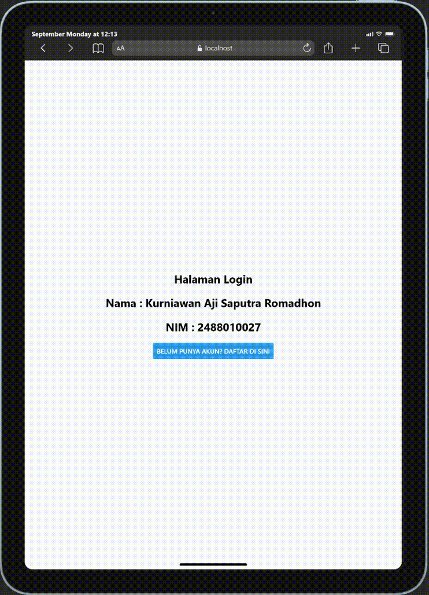
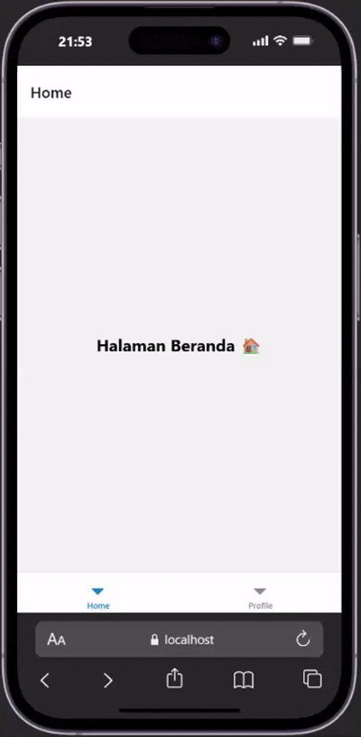
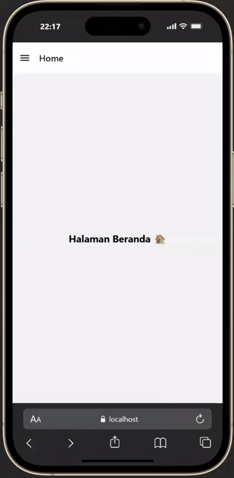

# Praktikum 4: React Native Navigation #

## Tujuan pembelajaran ##
Mahasiswa mampu :
1. Merancang dan menerapkan navigasi antar layar (screen) pada aplikasi react native.
2. Menggunakan library React Navigation (Stack Navigator, Tab Navigator, Drawer Navigator).

## Alur praktikum ##

### Langkah 1: Instalilsasi proyek React Native ###
1. Buka terminal atau command prompt
2. Ubah directori ke folder pertemuan 4 (cd "Pemrograman mobile-4")
3. buat proyek menggunakan perintah berikut : 'npx create-expo-app ptmn --template blank'
4. masuk ke dalam folder proyek menggunakan perintah berikut : 'cd ptmn4'
5. Install core navigation library npm install @react-navigation/native
6. Install dependensi pendukung (wajib untuk Expo) npx expo install react-native-screens react-native-safe-area-context react-native-gesture-handler react-native-reanimated 

### Langkah 2: Membuat Stack Navigator ###
1. instalalasi pustaka stack : npm install @react-navigation/native-stack
2. buat folder di dalam projek dengan nama screens
3. di dalam folder screens buat 2 file dengan nama login.js dan signup.js
4. masukan kode sesuai pada modul praktikum 4
5. sesuaikan file App.js dengan kode yang ada pada modul.
6. simpan dan install emulator web : 'npx expo install react-dom react-native-web'
7. jalankan perintah 'npx expo start --web'
8. konfirmasi bukti

### Langkah 3: Bottom Tab Navigator ###
1. Install pustaka bottom tabs: npm install @react-navigation/bottom-tabs
2. Di folder screens, buat HomeScreen.js dan ProfileScreen.js.
3. sesuaikan file App.js dengan kode yang ada pada modul.
4. Konfirmasi bukti

### Langkah 4: Drawer Navigator ###
1. Install pustaka drawer: npm install @react-navigation/drawer
2. Pastikan react-native-gesture-handler dan react-native-reanimated sudah terpasang (sudah dilakukan di Langkah 1).
3. Ganti seluruh isi App.js dengan (gunakan kembali layar Home dan Profile)
4. Konfirmasi bukti

